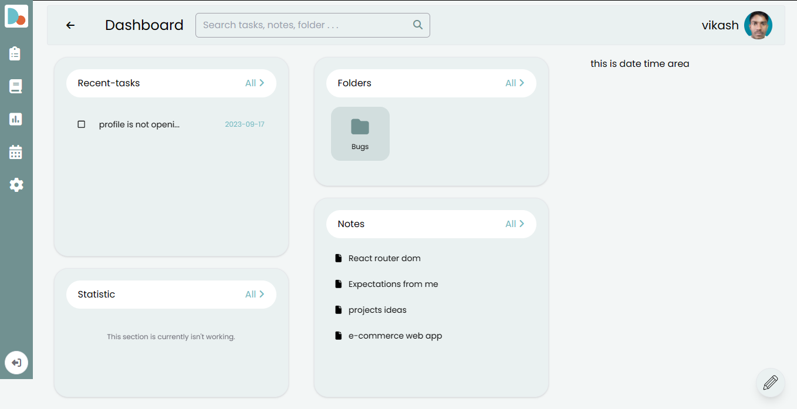

<!-- ```markdown -->
# Task Manager App

Welcome to the Task Manager App! This web application is designed to help you manage tasks and notes efficiently. It offers user accounts, a customizable dashboard, a text editor, and more. Please note that this app is currently under construction, so your feedback is valuable in improving its functionality.



## *[Go to task manager app](https://devmrvicky.github.io/Task-manager/)*

## Features

### User Accounts

1. **User Sign-Up:** New users visiting the app for the first time must sign up by providing their name, username, and password and clicking the "Sign Up" button.

2. **User Profile:** The top right corner displays the user's name and icon. Clicking the user icon reveals a dialog with a list of all logged-in users, with the topmost user being the current user.

3. **Multiple User Accounts:** Users can create multiple accounts, and one account can be set as the current account.

4. **User Options:** Clicking the three vertical dots icon provides additional menu options. For the current user, options include editing the user, locking the user, logging out, and deleting the user; otherwise, only the "Hide User" option appears.

5. **Profile Editing:** Users can edit their profile and add a profile image.

6. **Lock Profile:** Users can lock their profile for added security.

### Dashboard

7. **Dashboard Landing:** After logging in, users land on the dashboard, which consists of three sections: Recent Tasks, Folders, and Notes.

8. **Navigation:** On the left side, users can navigate to different pages: Dashboard, Tasks, Notes, Statistics, and Settings.

### Text Editor

9. **Text Editor:** Clicking the editor icon in the bottom right corner opens the text editor. If this is the user's first time clicking it without navigating to the Notes page, the Task text editor will open; otherwise, the Note text editor will open.

10. **Editor Functionality:** In the text editor, users can write and save tasks and notes.

### Local Storage

11. **Local Storage:** All user information, tasks, and notes are saved in the browser's local storage. No external database is used for storage.

## Reporting Bugs

Since this app is in construction, your feedback is essential in identifying and fixing bugs. If you encounter any issues or have suggestions for improvements, please report them by [creating an issue](https://github.com/yourusername/task-manager-app/issues).

## License

This project is licensed under the [MIT License](./LICENSE). You are welcome to use, modify, and distribute this application for educational and personal purposes.

We appreciate your support and hope you find the Task Manager App helpful for your productivity needs!

Happy task and note management!
```

In this template, replace `[yourusername]` with your actual GitHub username and provide actual file paths for your app's screenshots. This README provides an in-depth overview of your app's features, usage instructions, and a reminder that the app is currently under construction, encouraging users to report bugs and provide feedback.